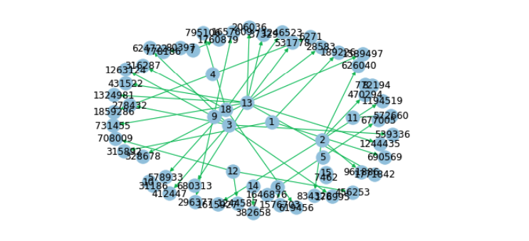
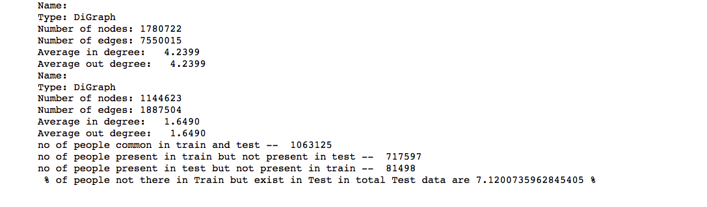
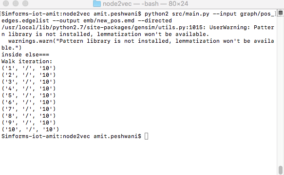

# Social-Network-Link-Prediction 

Every social network has a feature of friend suggestion . Friend suggestion is core part of a social network websites  . In Machine Learning term , this problem is called Link Prediction . 

## Problem Statement 

Given a directed social graph, have to predict missing links to recommend users (Link Prediction in graph)
Data Source : [Data](https://www.kaggle.com/c/FacebookRecruiting/data)

## Data Format

- train.csv contains the directed social graph, represented in a 2-column csv (source_node, destination_node)
- test.csv contains a list of nodes to recommend other nodes to in a 1-column csv (source_node)

## Approach 1

- Firstly used networkx to create graph from the data of connected friends (edges)
- Subgraph :

- Analysis :

- After analysis to train the model , manual features were added from the data of connected edges . Features like Jaccard , Cosine distance , Page Ranking , Shortest Path , Adar Index , Following back , etc were added . So that model will learn the information of graph . 
- For Supervised Learning , bad edges were added based on the distance of shortest path . 

## Approach 2 

- Embedding were generated using Node2Vec algorithm . In Node2Vec , Random Walks are generated for edges . There are certain parameters in Node2Vec like values of p and q , Number of walks , length of walks . After generation of Walks , it is feed into word2vec algorithm to create node embeddings . 
- After creation of node embeddings , edge embeddings are generated . Various methods like Hadamard , WeightedL1 , WeightedL2 , Average are used to create edge embeddings . Implementation can be found in Node2Vec [paper](https://arxiv.org/abs/1607.00653) . 
- Embeddings are concated with their respective edges . 
- Significant improvement was observed after using embeddings . 
- Embedding creation using Aditya Grover's [Node2vec](https://github.com/aditya-grover/node2vec) :

- Major Drawback of embedding approach is that it doesn't works well with cold start problems . This condition can be improved by appending manual features with embeddings.

## References 

* [Blog](https://blog.hike.in/networking-d06f58aa3f3e)
* [Node2Vec Github](https://github.com/aditya-grover/node2vec)
* [Features](http://be.amazd.com/link-prediction/)

