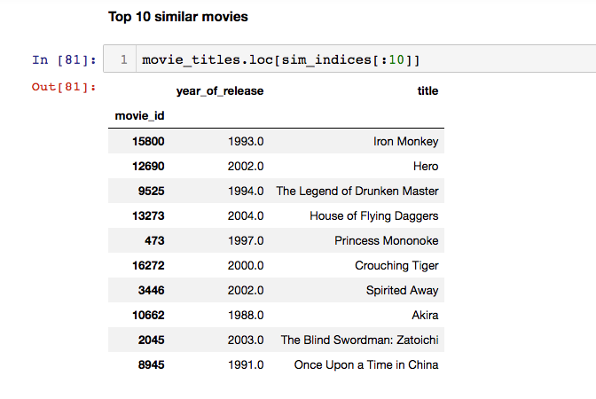
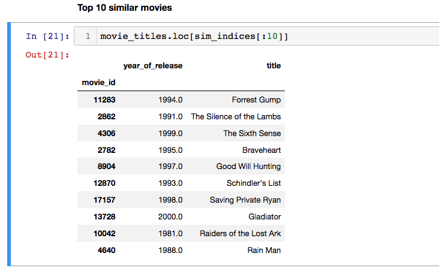
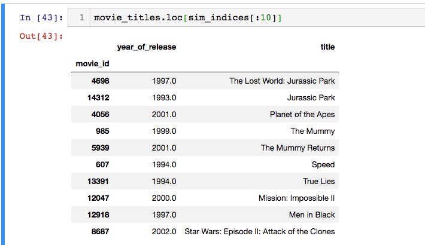

# Movie Recommendation

Netflix is all about connecting people to the movies they love. To help customers find those movies,they developed world-class movie recommendation system: CinematchSM. Its job is to predict whether someone will enjoy a movie based on how much they liked or disliked other movies. Netflix use those predictions to make personal movie recommendations based on each customer’s unique tastes.And while Cinematch is doing pretty well, it can always be made better. 

## Problem Statement 

Netflix provided a lot of anonymous rating data, and we have to improve the accuracy which predicts the user ratings . 
(Accuracy is a measurement of how closely predicted ratings of movies match subsequent actual ratings.)


## Objective 

1. Predict the rating that a user would give to a movie that he ahs not yet rated.
2. Minimize the difference between predicted and actual rating (RMSE and MAPE)

## Data

Data Files :
- combined_data_1.txt
- combined_data_2.txt
- combined_data_3.txt
- combined_data_4.txt
- movie_titles.csv

First line of each file [combined_data_1.txt, combined_data_2.txt, combined_data_3.txt, combined_data_4.txt] contains the movie id followed by a colon.
Each subsequent line in the file corresponds to a rating from a customer and its date in the following format:
- CustomerID,Rating,Date

MovieIDs range from 1 to 17770 sequentially.
CustomerIDs range from 1 to 2649429, with gaps. There are 480189 users.
Ratings are on a five star (integral) scale from 1 to 5.
Dates have the format YYYY-MM-DD.

### Example Data Points 
```
1:
1488844,3,2005-09-06
822109,5,2005-05-13
885013,4,2005-10-19
30878,4,2005-12-26
823519,3,2004-05-03
893988,3,2005-11-17
124105,4,2004-08-05
1248029,3,2004-04-22
1842128,4,2004-05-09
2238063,3,2005-05-11
1503895,4,2005-05-19
2207774,5,2005-06-06
2590061,3,2004-08-12
2442,3,2004-04-14
543865,4,2004-05-28
1209119,4,2004-03-23
804919,4,2004-06-10
1086807,3,2004-12-28
1711859,4,2005-05-08
372233,5,2005-11-23
```


## Type of Machine Learning Problem 

For a given movie and user we need to predict the rating would be given by him/her to the movie. The given problem is a Recommendation problem .It can also seen as a Regression problem 

## Performance Metric 

* Mean Absolute Percentage Error: [MAPE](https://en.wikipedia.org/wiki/Mean_absolute_percentage_error)
* Root Mean Square Error: [RMSE](https://en.wikipedia.org/wiki/Root-mean-square_deviation)


## Approach 

Recommendation systems are based on two approaches : Content Based and Collaborative filtering methods . 
When to use which approach ?
- Collaborative Based : An item is recommended to user based on user-user similarity or item-item similarity . 
Example : In this case-study the similarity  was  **Ratings** . Assume you are a user and you rate a TV series like Game of Thrones or Breaking Bad  a rating of 4 . Then How Netflix will recommend further items for binge watching . To solve this problem , it will find similar users who have given same ratings as you have given to GoT and based on his content that the particular user has watched , it will recommend you .

- Content Based : An item is recommended to user based on content .
Example : Assuming you are a New user who has recently joined Netflix and you haven't rated a single show . So how Netflix will decide which content to recommend you . Basically what happens when you sign up , Netflix asks you which type of movies you like and you select some X movies and based on the genre of movie , it will recommend you new shows . This problem is called **COLD START PROBLEM**

## Example

* Movie-Movie similarity based on ratings given by dfferent users .
( Only on similarity of ratings a similar movie is recommended . Genre is not considered . )

1. Shaolin Soccer :



2. Shawshank Redemption :



3. Jurassic Park 3 :



## Usage 

* Exploratory Data Analysis
* Cold Start Problem
* Similarity
* Applying ML Models for rating predictions


## Acknowledgments 

* Blog : [Netflix blog](https://medium.com/netflix-techblog/netflix-recommendations-beyond-the-5-stars-part-1-55838468f429)
* Surprise library : [Library](http://surpriselib.com)
* Paper : [Paper](http://courses.ischool.berkeley.edu/i290-dm/s11/SECURE/a1-koren.pdf)


