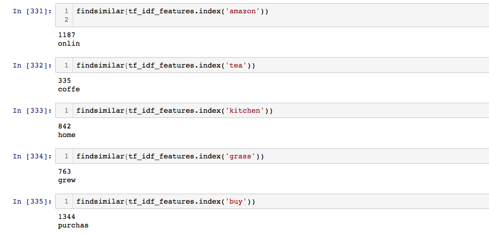
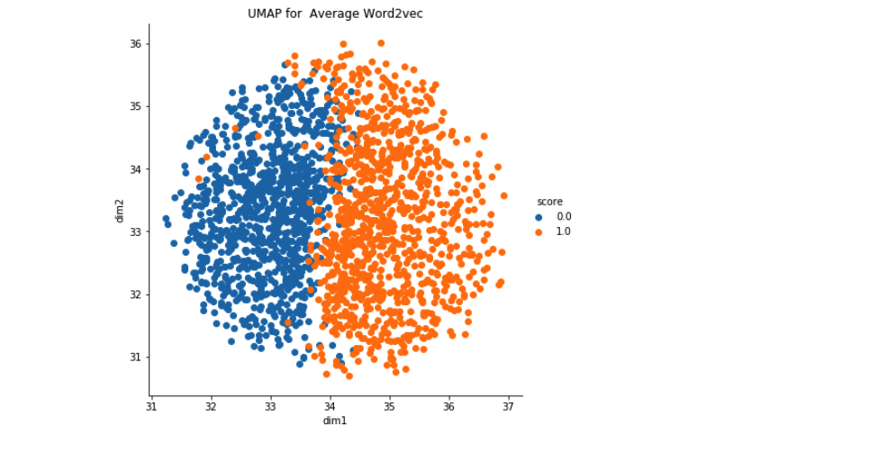
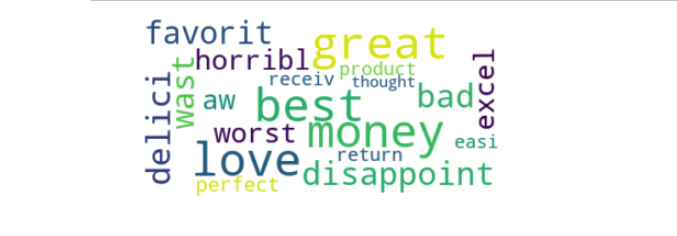

# Amazon Food Reviews - NLP 

Data Source : [Data](https://www.kaggle.com/snap/amazon-fine-food-reviews)

The Amazon Fine Food Reviews dataset consists of reviews of fine foods from Amazon.

- Number of reviews: 568,454
- Number of users: 256,059
- Number of products: 74,258
- Timespan: Oct 1999 - Oct 2012
- Number of Attributes/Columns in data: 10

Attribute Information:

- Id
- ProductId - unique identifier for the product
- UserId - unqiue identifier for the user
- ProfileName
- HelpfulnessNumerator - number of users who found the review helpful
- HelpfulnessDenominator - number of users who indicated whether they found the review helpful or not
- Score - rating between 1 and 5
- Time - timestamp for the review
- Summary - brief summary of the review
- Text - text of the review

## Machine-Learning Objective 

Based on review text , identify the reviews are negative or positive .

## Approach

### Preprocessing 

- Data Cleaning - Deduplications
- Removing html tags , punctuations and set of special characters like , or . or # etc .
- Checking if the word is made up of english letters and not alpha numeric characters . 
- Converting to lowercase . 
- Removal of stopwords .
- Stemming of words . 

### Featurization 

It is necessary to convert the words in vector format for NLP tasks . So used following methods to convert words in vector format . 

* Bag of Words (BoW)
* Bi-Grams and N-Grams
* TF-IDF (Term Frequency–Inverse Document Frequency)
* Average Word2Vec
* TF-IDF weighted Word2vec

- Word2Vec is the most popular technique to learn word embeddings . Embeddings are the vector representation of words and it is capable of capturing context of a word in a document , semantic and syntatic similarity , relation with other words , etc . 

## Implementations 

* Dimensionality Reduction using t-SNE , PCA 
* Naive Bayes
* Logistic Regression
* SGD for linear Regression 
* Support Vector Machines
* Decision Trees
* Random Forests and GBDT
* KMeans , Agglomerative and Hierarchical Clustering methods (Unsupervised)
* TruncatedSVD (Co-occurrence matrix) - Matrix Factorization method (Used in recommendation systems)

## Examples 

- Truncated SVD (Based on occurrence similar words) :

- Dimensionality reduction using UMAP on Average W2V to visualize seperation of positive and negative reviews :

- Top 20 important words that are responsible for classification of reviews :

