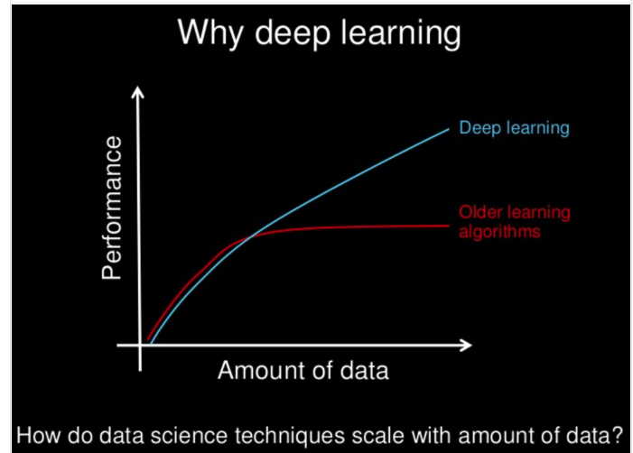

# Machine Learning Case Studies 

In this Repository following things are covered :
* [NLP](https://github.com/simformsolutions/MachineLearningCaseStudies/tree/master/NLP-Amazon-Food-Reviews)
* [Deep-Learning](https://github.com/simformsolutions/MachineLearningCaseStudies/tree/master/footwear-best-view-classification)
* [Recommender Systems](https://github.com/simformsolutions/MachineLearningCaseStudies/tree/master/Movie-Recommendation-Casestudy)

## Requirement 

* Sklearn
* Tensorflow
* Keras
* Numpy
* Pandas 
* Python 3

## Natural Language Processing (NLP) :

Natural Language Processing is an subfield of AI that is focused on enabling computers to understand and process human languages . The basic is idea is to break the problems in several parts and then use machine learning to solve each part seperately . We divided the preprocessing into following steps before training any model for NLP tasks :

- Sentence Segmentation 
- Word Tokenization
- Text Lemmatization
- Identifying/Removal stop words 
- Converting tokens into ids (Deep Learning)

After Preprocessing , words are converted into vectors as machines are good at understanding vectors rather than words . To convert words into vectors we have used following featurizations 

- Bag of Words
- TF-IDF
- Word2Vec
- Average W2V

After featurization , vectors are passed into state of the art machine learning algorithms for several tasks like sentiment analysis , classification like positive or negative review , etc . Implementation can be found [here](https://github.com/simformsolutions/MachineLearningCaseStudies/tree/master/NLP-Amazon-Food-Reviews)

## Deep Learning 

Deep Learning is a subfield of machine learning concerned with algorithms inspired by the structure and function of the brain called artificial neural networks.In deep learning, a computer model learns to perform classification tasks directly from images, text, or sound. Deep learning models can achieve state-of-the-art accuracy, sometimes exceeding human-level performance. Models are trained by using a large set of labeled data and neural network architectures that contain many layers.

We have used following following neural networks to work with images and text data :
- MLP (Multi-Layer Perceptrons)
- CNN (Convolutional Neural Nets)
- RNN (LSTM)

Implementation of CNN with unsupervised learning can be found [here](https://github.com/simformsolutions/MachineLearningCaseStudies/tree/master/footwear-best-view-classification)

We are planning to add following things :
* [Attention Network](https://ai.google/research/pubs/pub46201)
* [Transformers](https://ai.googleblog.com/2017/08/transformer-novel-neural-network.html)
* [BERT](https://ai.googleblog.com/2018/11/open-sourcing-bert-state-of-art-pre.html)

## References :

* [Machine-Learning-Mastery](https://machinelearningmastery.com/what-is-deep-learning/)
* [Blog](https://medium.com/@ageitgey/natural-language-processing-is-fun-9a0bff37854e)
