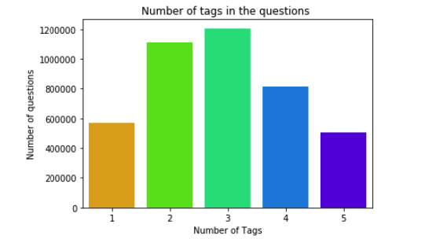
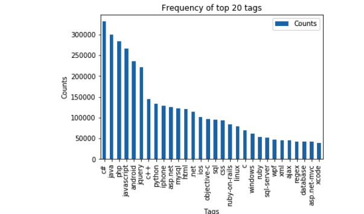

# Stackoverflow-Tag-Predictor 

Stack Overflow is something which every programmer use one way or another. Each month, over 50 million developers come to Stack Overflow to learn, share their knowledge, and build their careers. It features questions and answers on a wide range of topics in computer programming. The website serves as a platform for users to ask and answer questions, and, through membership and active participation, to vote questions and answers up or down and edit questions and answers in a fashion similar to a wiki or Digg. As of April 2014 Stack Overflow has over 4,000,000 registered users, and it exceeded 10,000,000 questions in late August 2015. Based on the type of tags assigned to questions, the top eight most discussed topics on the site are: Java, JavaScript, C#, PHP, Android, jQuery, Python and HTML.

## Problem statement 

Suggest the tags based on the content that was there in the question posted on Stackoverflow.

Data Source : [Data](https://www.kaggle.com/c/facebook-recruiting-iii-keyword-extraction/data)

## Approach 

### Data Cleaning and Exploratory Data Analysis 

- Removal of duplicate questions 
- Analysis of tags per question . There were max 5 tags per question . 

- Total Number of Questions - 4206314
- Unique Tags - 42048
- After sorting the tags based on their occurance in question , top 14 tags occurs in 100000 questions . 
- Wordcloud of most frequent tags . 

- Occurence of top 20 tags .

- Removal of stopwords,HTML tags and code snippets because it increases the dimensionality and it is not helpful . 
- Stemming of words . 

### Modeling

The type of problem is Multi-Label . Micro-F1-Score as a metric . 

- Logistic Regression(SGDClassifier) with tfidf featurization
- Logistic Regression(OneVSRest) with tfidf	featurization
- Logistic Regression with BoW	
- Logistic Regression with Hyperparameter Tuning
- Linear SVM with SGDClassifier

### Feature Engineering 

Mostly title is the most important part of the question and it describes the overall question . So logically giving more weight to title will increase the performance of the model . Added the title x3 to increase the weight . Performed modeling on 0.5 questions and top 500 tags . After this feature engineering , there was improvement in the model .

## References :

* [Sci-Kit learn Multilabel Classification](https://www.youtube.com/watch?v=nNDqbUhtIRg&feature=youtu.be)
* [Paper](https://www.microsoft.com/en-us/research/wp-content/uploads/2016/02/tagging-1.pdf)
